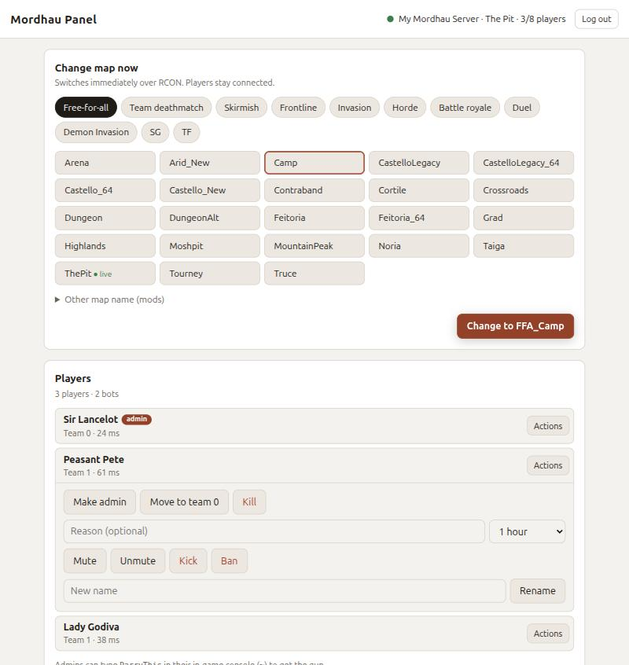

# Mordhau Server for TrueNAS

Run your own **Mordhau dedicated server** on TrueNAS, with a simple **web
panel** to change maps, manage players and edit settings from any browser,
including your phone.

## What you get

- **A Mordhau dedicated server** that installs and updates itself from Steam.
- **A web panel** on port 37080:
  - **Change the map now.** Pick a mode and a map; players stay connected.
  - **Players.** See who is online, make friends admin, move teams, mute,
    kick, ban, rename, add bots, message everyone, extend the match.
  - **Rotation & startup map.** Any number of maps, in any order.
  - **Server settings.** Name, join password, admin password, max players,
    public listing.
  - **Console** for any other server command.
- **A setup screen** on first start, so the install itself needs no passwords
  or config editing.

## Install

**[→ Step-by-step install guide](docs/INSTALL.md)** (about 10 minutes, no
command line needed)

The short version:

1. Create a dataset with the **Apps** preset.
2. Apps → Discover Apps → ⋮ → **Install via YAML**, paste
   [`compose.truenas.yaml`](compose.truenas.yaml), change the dataset path.
3. Copy the **setup code** from the panel's log.
4. Open `http://<your-truenas-ip>:37080`, enter the code, pick your
   passwords and server name. Done.

### What you need

- **TrueNAS SCALE 24.10 (Electric Eel) or newer** (tested on 25.10), with Apps set up (a pool
  chosen for apps).
- About **15 GB of free space** on that pool for the game server files.
- About **4 GB of free RAM** while the server runs.
- A copy of Mordhau (Steam or Epic) to play on it.

## Documentation

| Guide | For |
| --- | --- |
| [Install guide](docs/INSTALL.md) | Installing on TrueNAS, step by step |
| [Using the panel](docs/PANEL.md) | What every part of the panel does |
| [Playing with friends](docs/PLAYING.md) | Joining the server, inviting friends, port forwarding |
| [Configuration reference](docs/CONFIGURATION.md) | Every setting, file and port; plain Docker installs |
| [Troubleshooting](docs/TROUBLESHOOTING.md) | When something does not work |
| [Development](docs/DEVELOPMENT.md) | Building, testing and how it works inside |

## Security in one paragraph

The panel is meant for your **home network or Tailscale**. It uses a login
page but no HTTPS, so **never forward port 37080 on your router**. Only the
game ports (37000, 37002, 37003 UDP) should ever be forwarded, and only if
friends join over the internet. The RCON port is not exposed at all; the
panel reaches it inside the app.

## License

[GPL-3.0](LICENSE). Mordhau is a trademark of Triternion; this project is not
affiliated with or endorsed by Triternion. The server files are downloaded
from Steam at startup and are not part of this project.
