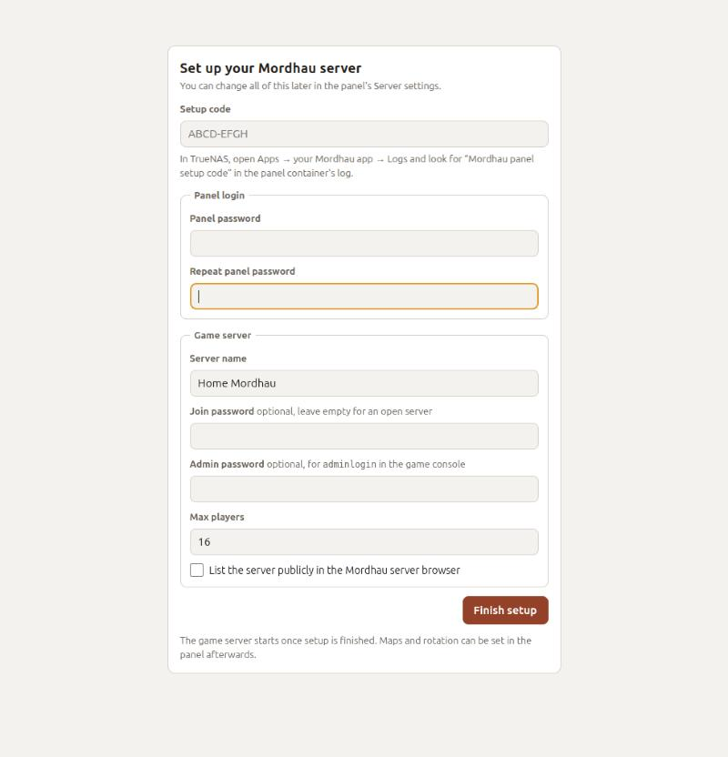

# Install guide

This guide installs the Mordhau server and its web panel on TrueNAS. You only
use the TrueNAS web interface and a browser; no command line.

**Time:** about 10 minutes, plus the first download of the game server.

## Before you start

You need:

- **TrueNAS SCALE 24.10 or newer** (tested on 25.10).
- **Apps set up** in TrueNAS: if you have never used Apps, open **Apps** once
  and choose a pool when TrueNAS asks.
- About **15 GB free** on that pool and about **4 GB free RAM**.
- Your TrueNAS **IP address** (the one you type to open the TrueNAS web page,
  e.g. `192.168.1.50`).

## Step 1: Make a folder for the server

The server keeps its game files, settings and logs in a dataset.

1. In TrueNAS, open **Datasets**.
2. Click the pool (or parent dataset) where it should live, then
   **Add Dataset**.
3. **Name:** `MordhauServer`
4. **Dataset Preset:** choose **Apps**. This gives the app permission to
   write there.
5. Click **Save**.
6. Note the dataset's path. It is `/mnt/` + the pool + the name, for example
   `/mnt/tank/MordhauServer`. You will need it in step 2.

> If you skip the **Apps** preset, the server cannot write its files. See
> [Troubleshooting](TROUBLESHOOTING.md#permission-denied).

## Step 2: Install the app

1. Open **Apps** → **Discover Apps**.
2. Click the **⋮** menu (next to **Custom App**) → **Install via YAML**.
3. **Name:** `mordhau`
4. Open [`compose.truenas.yaml`](../compose.truenas.yaml), click **Copy raw
   file** (the copy icon above the file), and paste it into the big text box.
5. Find the two lines that say

   ```yaml
   source: /mnt/Apps/MordhauServer
   ```

   and change both to **your** dataset path from step 1, e.g.

   ```yaml
   source: /mnt/tank/MordhauServer
   ```

6. Optional: change `TZ: Europe/Prague` to your time zone.
7. Click **Save**.

TrueNAS now downloads the two containers and starts them. The game server
then downloads the Mordhau server files from Steam. That takes a few minutes
the first time, depending on your internet speed. It waits for you to finish
the setup before it actually starts.

## Step 3: Get the setup code

The setup code proves that it is you setting up the panel, not someone else
on your network.

1. Open **Apps** → **Installed** and click **mordhau**.
2. In the **Workloads** section, find the **panel** container and click its
   **logs** icon (the page-with-lines icon).
3. Look for a block like this:

   ```text
   ============================================================
     Mordhau panel setup code: K7QX-M2PD
     Open the panel on port 37080 and enter this code.
   ============================================================
   ```

4. Copy the code (`K7QX-M2PD` in the example; yours is different).

> The code changes every time the panel restarts, until setup is done. If the
> code does not work, check the log again for the newest one.

## Step 4: Finish setup in the panel

1. Open the panel: in TrueNAS, **Apps** → **mordhau** → **Web UI**. (Or type
   `http://<your-truenas-ip>:37080` in your browser, for example
   `http://192.168.1.50:37080`.)
2. Fill in the setup screen:

   

   | Field | What to put |
   | --- | --- |
   | **Setup code** | The code from step 3 (dashes and capitals do not matter). |
   | **Panel password** | The password for this panel. At least 8 characters. |
   | **Server name** | What players see in the server list. |
   | **Join password** | Optional. Players must type it to join. Leave empty for an open server. |
   | **Admin password** | Optional. Lets someone become admin in game with `adminlogin <password>`. You can also make friends admin from the panel instead. |
   | **Max players** | How many players fit on the server. |
   | **List publicly** | Tick it if the server should appear in Mordhau's public server browser. |

3. Click **Finish setup**.

The panel opens, and the game server starts within a few seconds. When the
top of the panel shows a **green dot** with your server name and a map, the
server is up.

**That's it.** Bookmark the panel address. It remembers your login for 30
days on each device.

## Next steps

- **Play on it:** see [Playing with friends](PLAYING.md).
- **Learn the panel:** see [Using the panel](PANEL.md).
- **Choose your maps:** in the panel, **Rotation & startup map**, then
  **Save & restart**.
- **Optional, map pictures:** import the official map pictures from your
  game, see [Map pictures](PANEL.md#map-pictures).
- **Optional, app icon:** TrueNAS shows YAML apps without an icon, and the
  YAML cannot set one. To give the app Mordhau's icon, open **System** →
  **Shell** in TrueNAS and run:

  ```bash
  curl -fsSLO https://raw.githubusercontent.com/infish/truenas-mordhau/main/tools/truenas-set-app-icon.py
  sudo python3 truenas-set-app-icon.py
  ```

  It finds the Mordhau app by itself and keeps a backup of what it changes.
  The icon stays when you edit or update the app; run it again only if you
  delete and reinstall the app.

## Updating

**The Mordhau server** updates itself from Steam every time the app starts.
After a Mordhau patch, restart the app in TrueNAS (**Apps** → **mordhau** →
**Restart**).

**This project** (the panel and the server image): TrueNAS checks for new
images and marks the app with an update in **Apps**; click **Update** on it.
Your settings, maps, admins and bans are kept; they live in your dataset.

## Uninstalling

Delete the app in **Apps**. Your dataset keeps the game files and settings;
delete the dataset too if you want everything gone.
